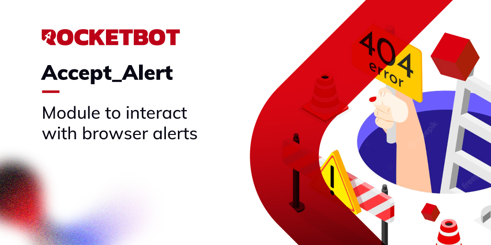

# AcceptAlert

Modules to accept or reject an alert in the browser

*Read this in other languages: [English](Manual_acceptAlert.md), [Português](Manual_acceptAlert.pr.md), [Español](Manual_acceptAlert.es.md)*

## Como instalar este módulo

Para instalar o módulo no Rocketbot Studio, pode ser feito de duas formas:
1. Manual: __Baixe__ o arquivo .zip e descompacte-o na pasta módulos. O nome da pasta deve ser o mesmo do módulo e dentro dela devem ter os seguintes arquivos e pastas: \__init__.py, package.json, docs, example e libs. Se você tiver o aplicativo aberto, atualize seu navegador para poder usar o novo módulo.
2. Automático: Ao entrar no Rocketbot Studio na margem direita você encontrará a seção **Addons**, selecione **Install Mods**, procure o módulo desejado e aperte instalar.

## Descrição do comando

### AcceptAlert

Confirmar ou cancelar um alerta
|Parâmetros|Descrição|exemplo|
| --- | --- | --- |
|Option|||
|Mande texto||Texto|
|Salvar text||Variável|

### Aguarde Alerta

Aguarde um alerta os segundos definidos
|Parâmetros|Descrição|exemplo|
| --- | --- | --- |
|Segundos||5|
|Não mostrar exepção no terminal|Ao marcar esta opção, uma exceção não será mostrada no terminal a cada segundo onde nenhuma alerta foi encontrada||
|Atribuir resultado a variável|||
